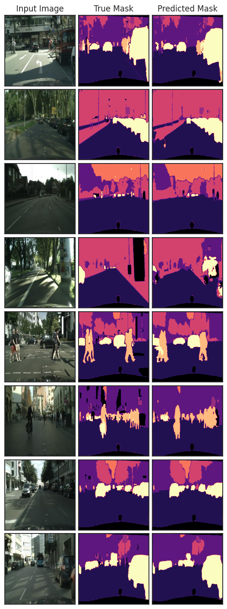

# SemanticSegmentation

A github version of kaggle notebook where I explored few semantic segmentation architectures on subset of CityScapes dataset. 
The notebook contains IoU, DICE losses, and 4 architectures : 
- UNet, 
- ENet,
- ESNet,
- DeepLabV3.
 
Link to kaggle notebook https://www.kaggle.com/code/levusik/semantic-segmentation-pytorch-unet-enet-esnet
  
Summary of results  

| Network Name | mDICE  | mIoU  | number of parameters |
|---|---|---|---|
| UNet  | 0.8541 | 0.7463  |7,763,272|
| ENet  | 0.835  | 0.716  |350,076|
| ESNet  | 0.8515  | 0.7422  |1,658,356|
| DeepLabV3  | 0.8617  | 0.758  | 39,635,528|

